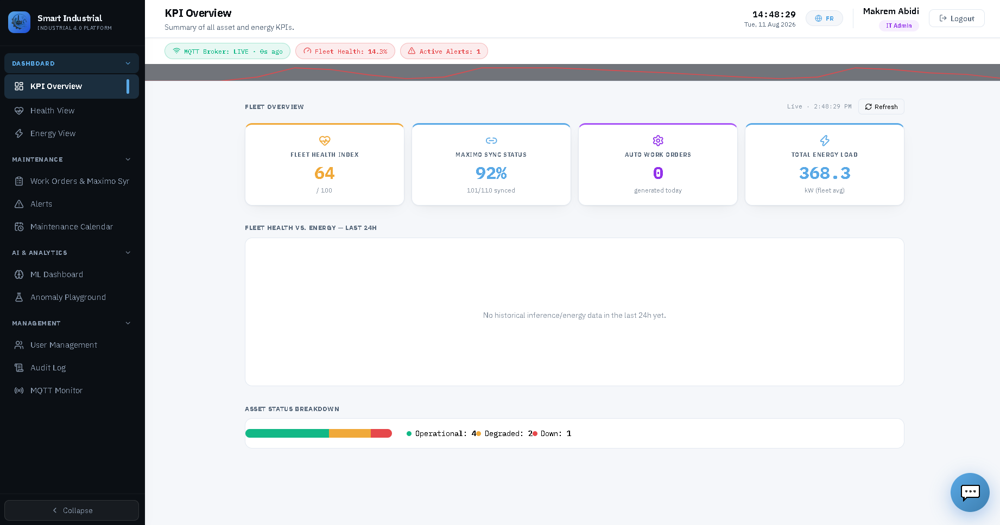
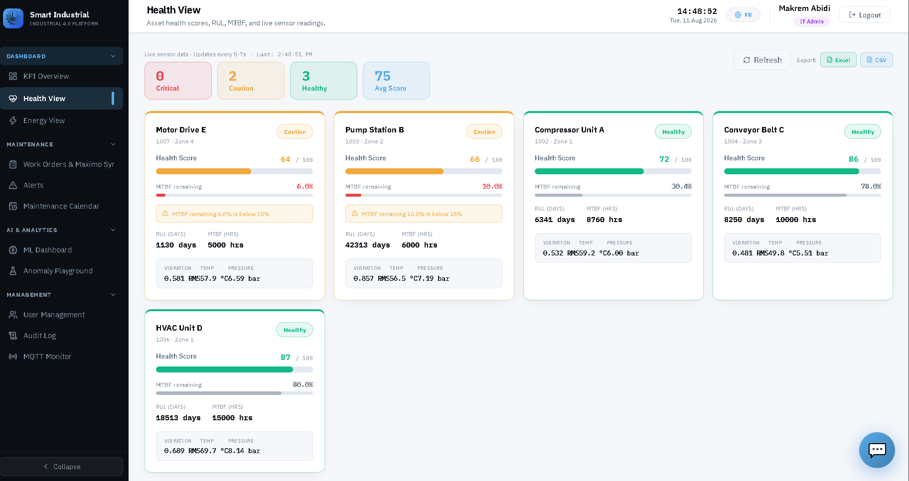
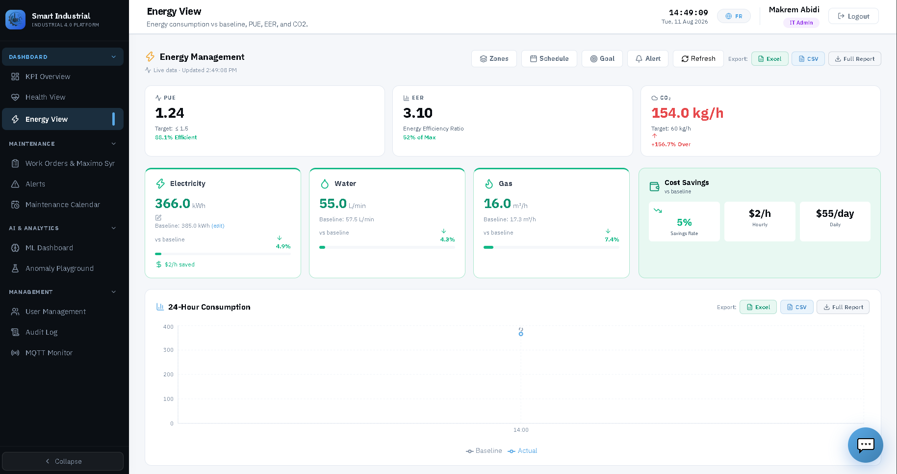
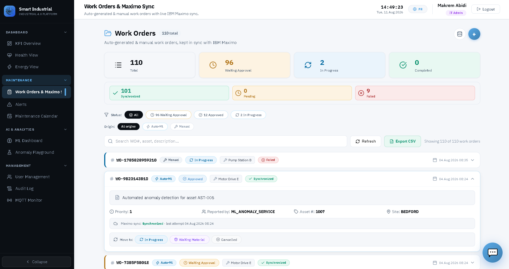
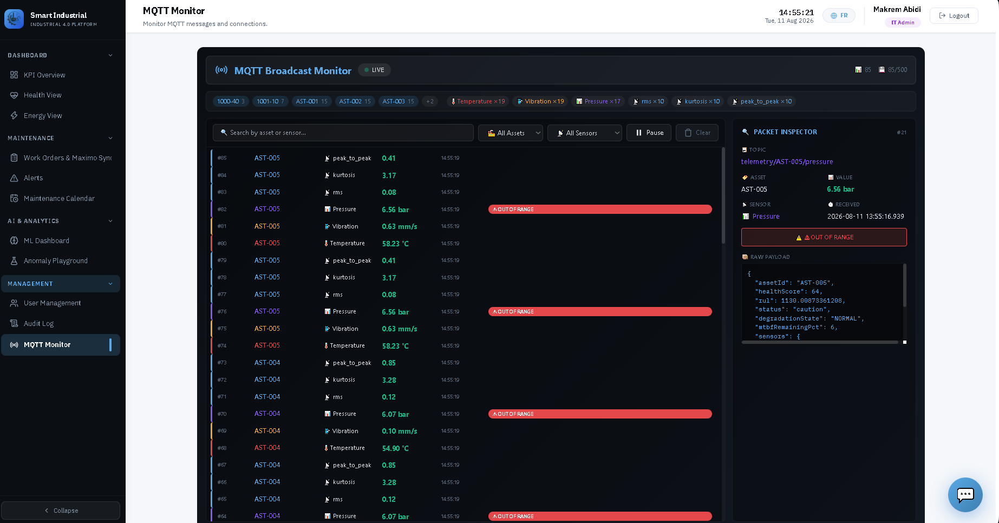
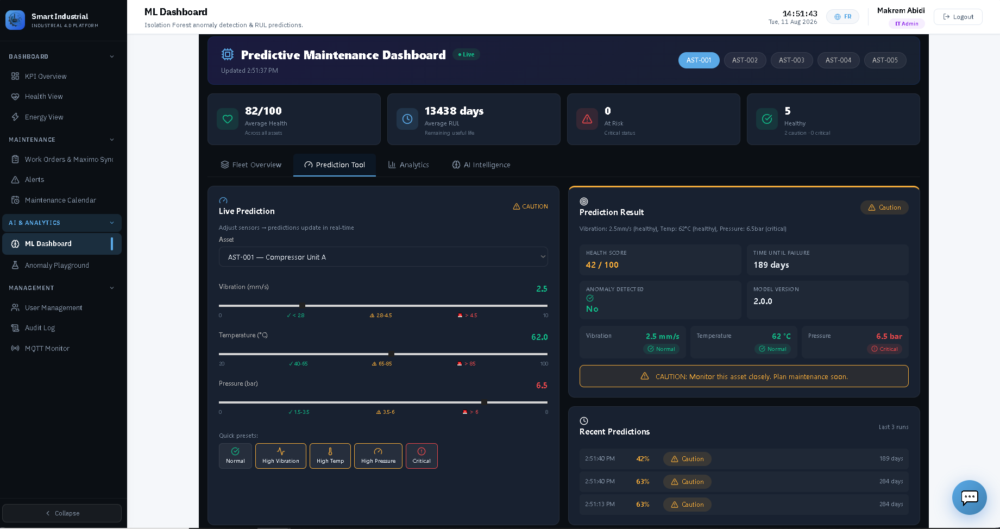
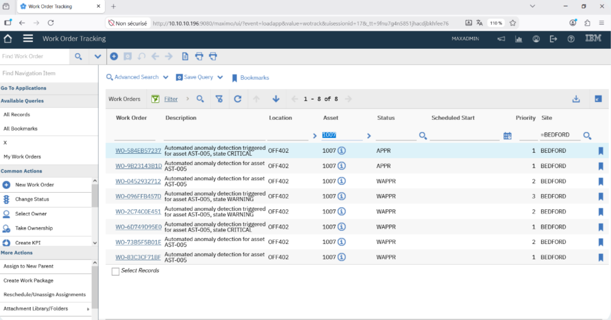

<div align="center">

# 🏭 Smart Industrial Dashboard

### Predictive Maintenance & Energy Performance Platform

*Enterprise-grade industrial monitoring combining IoT telemetry, machine learning, energy analytics, and IBM Maximo integration.*


</div>

---

## 📑 Table of Contents

- [Overview](#-overview)
- [Core Capabilities](#-core-capabilities)
- [Workflow](#-workflow)
- [Architecture](#-architecture)
- [Technology Stack](#-technology-stack)
- [Screenshots](#-screenshots)
- [Project Structure](#-project-structure)
- [Machine Learning Pipeline](#-machine-learning-pipeline)
- [Installation](#-installation)
- [IBM Maximo Integration](#-ibm-maximo-integration)
- [User Roles](#-user-roles)
- [API Overview](#-api-overview)
- [Key Improvements](#-key-improvements)
- [Demo](#-demo)
- [Academic Context](#-academic-context)
- [License](#-license)

---

## 📖 Overview

**SmartDashboard** is a full-stack **Industry 4.0** platform built to monitor industrial assets, detect anomalies, estimate **Remaining Useful Life (RUL)**, manage energy consumption, and automate maintenance workflows through **IBM Maximo** integration.

It bridges the gap between **raw industrial telemetry** and **actionable maintenance decisions** — powered by machine learning and enterprise asset management.

---

## ⚡ Core Capabilities

| | Capability | Description |
|---|-----------|-------------|
| 📡 | **Real-time Monitoring** | Live industrial telemetry streaming |
| 🧠 | **Anomaly Detection** | Isolation Forest model on sensor data |
| ⏳ | **RUL Prediction** | Remaining Useful Life estimation per asset |
| 💚 | **Asset Health Scoring** | Continuous health index per machine |
| ⚡ | **Energy Management** | Consumption KPIs & sustainability tracking |
| 📨 | **MQTT Streaming** | Lightweight IoT data pipeline |
| 🗄️ | **SQL Analytics** | Microsoft SQL Server-backed storage |
| 🔗 | **IBM Maximo MIF** | Enterprise work-order integration |
| 🛠️ | **Auto Work Orders** | Triggered from anomaly detection |
| 🔐 | **Role-Based Access** | Engineer / Energy / Admin roles |

---

## 🔄 Workflow

```text
┌─────────────────┐
│  IoT Sensors    │  Vibration · Temperature · Pressure
└────────┬────────┘
         │
         ▼
┌─────────────────┐
│  MQTT Broker    │  (Mosquitto) — real-time streaming
└────────┬────────┘
         │
         ▼
┌─────────────────┐
│  Node.js API    │  Ingests + stores telemetry
└────────┬────────┘
         │
         ├──────────────┐
         ▼              ▼
┌──────────────┐  ┌──────────────────┐
│ SQL Server   │  │  FastAPI ML      │
│ (Storage)    │  │  Anomaly + RUL   │
└──────┬───────┘  └────────┬─────────┘
       │                   │
       └─────────┬─────────┘
                 ▼
       ┌──────────────────┐
       │  React Dashboard │  Real-time UI (Socket.IO)
       └────────┬─────────┘
                │
                ▼
       ┌──────────────────┐
       │  IBM Maximo      │  Auto work-order sync
       └──────────────────┘
```

**Flow in words:**

1. **Sensors** emit vibration, temperature, and pressure readings
2. **MQTT broker** streams them in real time
3. **Node.js API** ingests and stores data in **SQL Server**
4. **ML service (FastAPI)** scores anomalies and predicts **RUL**
5. **React dashboard** visualizes everything live
6. **IBM Maximo** receives auto-generated work orders for critical assets

---

## 🏗️ Architecture

```text
React Frontend
      │
      ▼
Node.js + Express API
      │
 ┌────┴────┐
 ▼         ▼
SQL     MQTT
Server  Broker
 │
 ▼
FastAPI ML Service
 │
 ▼
IBM Maximo
```

---

## 🧰 Technology Stack

| Layer | Technologies |
|:------|:-------------|
| **Frontend** | React, Recharts |
| **Backend** | Node.js, Express |
| **Database** | Microsoft SQL Server |
| **Messaging** | MQTT (Mosquitto) |
| **Machine Learning** | Python, FastAPI, Scikit-Learn |
| **Auth** | JWT |
| **Realtime** | Socket.IO |
| **Integration** | IBM Maximo MIF |

---

## 🖼️ Screenshots

<div align="center">

### 📊 KPI Overview
*Fleet health, Maximo sync status, auto work orders & energy load at a glance.*



### 💚 Health View
*Asset health scores, RUL, MTBF, and live sensor readings.*



### ⚡ Energy View
*Energy consumption vs baseline — PUE, EER, CO₂, and cost savings.*



### 🛠️ Work Orders & Maximo Sync
*Auto-generated work orders with live IBM Maximo synchronization.*



### 📨 MQTT Monitor
*Live telemetry stream with packet inspector and out-of-range alerts.*



### 🧠 ML Dashboard
*Isolation Forest anomaly detection & RUL predictions with live prediction tool.*



### 🔗 IBM Maximo Work Order Tracking
*Work orders synced into the Maximo enterprise system.*



</div>

---

## 📁 Project Structure

```text
smartdashboard/
├── backend/          # Node.js + Express API
├── frontend/         # React dashboard
├── ml-service/       # FastAPI + ML models
├── sql/              # Database schemas
└── mosquitto/        # MQTT broker config
```

---

## 🧠 Machine Learning Pipeline

### 📥 Inputs
`Vibration` · `Temperature` · `Pressure`

### 🔧 Features
- RMS Mean
- RMS Standard Deviation
- Kurtosis Mean
- Peak-to-Peak Mean

### 📤 Outputs
- Anomaly Score
- Health Score
- Degradation State
- Remaining Useful Life (RUL)

### 🚦 Asset States

| State | Meaning |
|:-----:|:--------|
| 🟢 **NORMAL** | Healthy |
| 🟡 **WARNING** | Degrading |
| 🔴 **CRITICAL** | Immediate attention required |

---

## 🚀 Installation

### 1️⃣ Create Database

```sql
sql/base_schema.sql
sql/schema_extension.sql
```

### 2️⃣ Install ML Service

```bash
cd ml-service
pip install -r requirements.txt
pip install matplotlib
```

### 3️⃣ Load Dataset

```bash
python dataset/ingest_dataset.py
```

### 4️⃣ Run Anomaly Processing

```bash
python pipeline/anomaly_pipeline.py
```

### 5️⃣ Train Models

```bash
python train.py
```

### 6️⃣ Start ML API

```bash
uvicorn main:app --port 8000
```

### 7️⃣ Start Backend

```bash
cd backend
npm install
npm start
```

### 8️⃣ Start MQTT Broker

```bash
mosquitto -c mosquitto/mosquitto.conf
```

### 9️⃣ Replay Telemetry

```bash
npm run publish
```

### 🔟 Start Frontend

```bash
cd frontend
npm install
npm start
```

---

## 🔗 IBM Maximo Integration

### 🟢 Local Mode
- No external dependencies
- Local work-order storage
- Ideal for development & demos

### 🔵 Real Maximo Mode

```env
MAXIMO_BASE_URL=https://your-maximo-instance/maximo
MAXIMO_API_KEY=your-api-key
MAXIMO_SITE_ID=SITEID
```

**Features:**
- ✅ Automatic work-order synchronization
- ✅ Retry queue
- ✅ Connection monitoring
- ✅ Sync history tracking
- ✅ Admin control panel

---

## 👥 User Roles

### 🔧 Maintenance Engineer
- Asset monitoring
- Work-order management
- Failure investigation

### ⚡ Energy Manager
- Energy KPI monitoring
- Sustainability reporting
- Consumption analysis

### 🖥️ IT Administrator
- User management
- System configuration
- Maximo integration management

---

## 🌐 API Overview

<details>
<summary><b>📦 Assets</b></summary>

```http
GET /api/assets
GET /api/assets/health
```
</details>

<details>
<summary><b>⚡ Energy</b></summary>

```http
GET /api/energy/*
```
</details>

<details>
<summary><b>🛠️ Work Orders</b></summary>

```http
GET  /api/workorders
POST /api/workorders
```
</details>

<details>
<summary><b>🚨 Alerts</b></summary>

```http
GET /api/alerts
```
</details>

<details>
<summary><b>👤 Users</b></summary>

```http
GET /api/users
```
</details>

<details>
<summary><b>🔗 Maximo</b></summary>

```http
GET  /api/maximo/test-connection
GET  /api/maximo/sync/recent
POST /api/maximo/sync/retry
```
</details>

---

## ✨ Key Improvements

- ✅ Real SQL-backed telemetry pipeline
- ✅ Isolation Forest anomaly detection
- ✅ RUL prediction engine
- ✅ Unified MQTT publisher
- ✅ Real IBM Maximo integration
- ✅ Maximo Sync dashboard
- ✅ Clean layered architecture
- ✅ Repository + Service patterns
- ✅ Real-time WebSocket updates

---

## 🎬 Demo

<div align="center">

> **Watch the full project demo 👇**

[](https://youtu.be/E_dHf1omZBE)

📩 **Contact:** [mahmoodabdulkareem27@gmail.com](mailto:mahmoodabdulkareem27@gmail.com)

</div>

---

## 🎓 Academic Context

Developed as a **Smart Industrial Dashboard** for predictive maintenance and energy performance management — demonstrating **Industry 4.0** concepts through IoT integration, machine learning, enterprise asset management, and operational analytics.

---

## 📄 License

Educational, research, and demonstration purposes.

---

<div align="center">

**⭐ If you found this project interesting, consider giving it a star!**

Made by [Mahmoud Abdulkareem](https://www.linkedin.com/in/mahmoud-abdulkareem)

</div>
